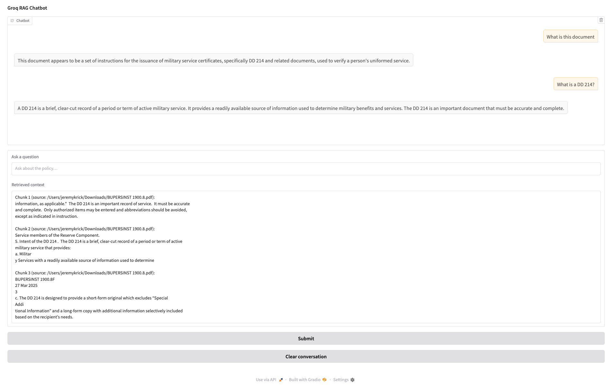

# Ready Tensor RAG Demo

This project demonstrates a retrieval-augmented generation (RAG) workflow that answers questions about the U.S. Navy BUPERSINST 1900.8 policy manual. A Jupyter notebook orchestrates document ingestion, chunking, embedding, and querying with LangChain, while the final cell exposes an interactive Gradio chatbot powered by Groq’s Llama 3.1 model. Use it to explore the policy quickly without manually scanning the PDF.

## Key Features
- Loads and inspects the BUPERSINST 1900.8 PDF to verify the source material.
- Splits the document into semantic chunks and embeds them with OpenAI’s `text-embedding-3-large`.
- Persists embeddings to both Chroma (on-disk) and an in-memory vector store for fast retrieval.
- Generates grounded answers by combining retrieved context with Groq’s Llama 3.1 model.
- Provides a Gradio UI so non-technical users can chat with the policy document.

## Requirements
- Python 3.10+
- API keys stored in environment variables:
  - `OPENAI_API_KEY`
  - `GROQ_API_KEY`
- Python dependencies (install with `pip install -r requirements.txt` if you add one, or individually):
  - `gradio`
  - `chromadb`
  - `langchain`, `langchain-openai`, `langchain-groq`, `langchain-community`, `langchain-core`
  - `pypdf` or another backend for `PyPDFLoader`

## Setup
1. Create and activate a virtual environment (recommended):
   ```bash
   python -m venv venv
   source venv/bin/activate
   pip install --upgrade pip
   ```
2. Install the required packages using `pip install <package>` for the list above (or rely on your own dependency file).
3. Place the PDF you want to analyze at the path expected in the notebook (currently `~/Downloads/BUPERSINST 1900.8.pdf`). Update the path in `groq_RAG.ipynb` if your file lives elsewhere.
4. Export your API keys:
   ```bash
   export OPENAI_API_KEY="sk-..."
   export GROQ_API_KEY="gsk_..."
   ```

## Running the Notebook
1. Launch Jupyter Lab or Notebook from the project root:
   ```bash
   jupyter lab
   ```
2. Open `groq_RAG.ipynb` and run the cells top to bottom.
3. After the embedding step completes, you can issue sample queries from within the notebook to verify the system responses.

## Using the Gradio Chatbot
- 
1. Run the final cell in `groq_RAG.ipynb` to launch the Gradio interface.
2. Open the provided local URL in your browser. Enter policy questions in the textbox; answers appear in the chat window alongside the retrieved supporting context.
3. Use the “Clear conversation” button to reset the session.
4. Expect API usage charges from both OpenAI and Groq while interacting with the app.

## Repository Layout
- `groq_RAG.ipynb` – main notebook with ingestion, embedding, querying, and UI.
- `chroma.sqlite3` – persisted Chroma database populated when the notebook runs.
- `app.py`, `Hello.py`, `test_script.py` – placeholder or exploratory files from early experimentation.
- `LoTR text/`, `archive (2)/`, and `40ff4286-ae02-4d93-a6a6-1b2121564a4b/` – sample data or scratch assets (not required for the RAG flow).

## Next Steps
- Add a `requirements.txt` or `pyproject.toml` to make dependency installation reproducible.
- Refine the chunking strategy (e.g., overlap or metadata enrichment) for better context retrieval.
- Extend the Gradio UI with authorization, logging, or analytics if you plan to share it more broadly.
